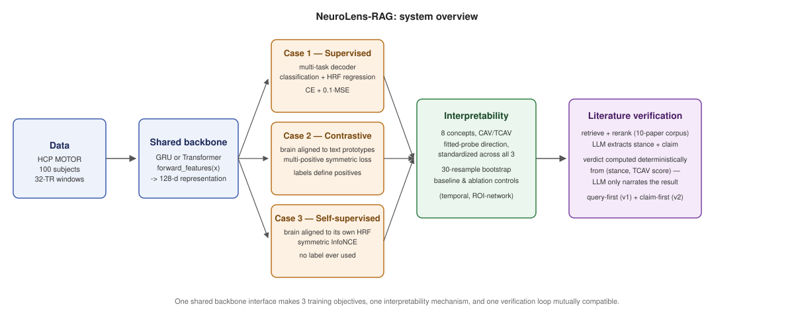

# NeuroLens-RAG

[](https://github.com/govinda-umd/NeuroLens-RAG/actions/workflows/tests.yml)
[](LICENSE)

**Does a brain-decoding model's accuracy come from something real, or a shortcut?** NeuroLens-RAG trains the same fMRI decoding task three structurally different ways: supervised, supervised-contrastive, and self-supervised. It tests whether each resulting representation depends on concepts a human would recognize, such as which body part moved, which side, or movement versus rest, using Concept Activation Vectors. Every claim is validated across 30 paired subject-level bootstrap resamples. The results are then cross-checked against retrieved neuroscience literature through a verification pipeline held to the same evidentiary standard. The system is built and validated on HCP Young Adult MOTOR-task fMRI data from 100 subjects.



## Headline results

1. **Architecture ranking flips by training paradigm; there is no fixed winner.** Transformer significantly beats GRU under both label-driven objectives, supervised and contrastive (paired Wilcoxon p<0.0001), but GRU edges ahead under the one objective that never sees a label, self-supervised (p=0.0004). Both results hold across 30 matched resamples per paradigm.
2. **A flat MLP statistically ties a recurrent model under two of three paradigms, but not the third.** FlattenMLP, which has no learned temporal structure at all, ties GRU under supervised and supervised-contrastive training (p=0.73 and p=0.887), then loses significantly under self-supervised training (p<0.0001). Recurrence appears to matter specifically when no label drives training directly, a result only visible once the baseline check was run across all three paradigms.
3. **All three paradigms converge to near-ceiling concept interpretability, but only once a diagnosed methodological artifact was fixed.** A convenient, zero-fit CAV-derivation shortcut looked like a real representational weakness in one paradigm, with TCAV around 0.33 on laterality and even the wrong sign for one backbone. A controlled experiment showed this was purely a limitation of the derivation method, not the representation: probe accuracy of 0.997 to 0.999 and TCAV of 0.92 to 1.00 once measured the same way as the other two paradigms.
4. **Reranking, not embedding fine-tuning, drives most of the retrieval quality.** A component-level ablation ladder (BM25, frozen embeddings, domain-adapted embeddings, each with and without cross-encoder reranking, and an oracle upper bound) shows that frozen embeddings plus reranking already match the fully fine-tuned pipeline. Domain adaptation alone buys a modest 0.04 gain in recall at 1, next to reranking's 0.28.
5. **A measured LLM sycophancy failure, fixed and formally audited.** Asked to freely judge whether retrieved literature supports a model's behavior, the verification LLM defaulted to agreement in 10 of 12 real cases regardless of the actual evidence. The fix computes the verdict deterministically from the stance and the concept-sensitivity score, so the LLM only narrates a decision it did not make. A formal precision, recall, and confusion-matrix audit against a labeled example set confirms the fix works, and shows its real tradeoff: it catches all four of the hardest "topically related but non-specific" failures, at a quantified cost to raw recall on clear cases.

Full detail, every number, every experiment that produced it: **[docs/end-to-end-report.md](docs/end-to-end-report.md)**.

## Contributions

Sole author and developer of this repository: architecture, training pipelines, interpretability mechanism, retrieval and verification system, statistical validation framework, and documentation.

## Installation and a minimal reproducible check

```bash
conda env create -f environment.yml
conda activate neurolens
```

PyTorch installation may vary by operating system and accelerator. Verify with `notebooks/00_environment_check.ipynb` after creating the environment.

**Verify the environment and core logic.** No data download is required; it runs against synthetic data in about five seconds.

```bash
pytest tests/ -v
```

**Reproduce a headline result.** This requires the processed HCP data (see Data access below). `notebooks/05_train_eval_compare.ipynb` trains and compares all four Case-1 architectures (GRU, Transformer, FlattenMLP, MeanPoolMLP) on one subject split in under a minute. `notebooks/12_population_level_evaluation.ipynb` and `notebooks/13_architecture_comparison_bootstrap.ipynb` run the full 30-resample population-level version behind headline result 1 above.

## What's here

- **Case 1, supervised multi-task decoding**: a GRU/Transformer encoder predicts movement class and hemodynamic response jointly.
- **Case 2, supervised-contrastive representation learning**: a symmetric multi-positive contrastive objective aligns a brain encoder and a text encoder of the six condition descriptions in a shared embedding space, with no classification head.
- **Case 3, self-supervised representation learning**: a brain encoder is aligned to its own window's hemodynamic-response vector via a symmetric InfoNCE loss. No class label ever enters training; a linear probe fit after the fact provides the readout needed for accuracy and interpretability testing.
- **Baseline and control battery**: flat and mean-pooled MLP baselines test whether learned temporal structure matters at all, temporal perturbation controls (shuffle, reverse, circular shift, mean-pool at test time) test whether a trained model actually relies on it, and ROI-network ablation controls test whether a suspected confound survives input-level lesioning. Every headline claim is checked against the simplest alternative explanation before being reported.
- **Mechanistic interpretability**: four attribution methods (Saliency, Integrated Gradients, exact Shapley, LIME) identify which resting-state network drives a decode, operating at the level of the seven Yeo canonical networks over a Schaefer-300 cortical parcellation. Concept Activation Vectors (CAV/TCAV) test whether a model's decision is causally sensitive to a human-specified concept, with the derivation mechanism standardized across all three paradigms.
- **Literature-grounded verification, two versions**: a RAG system retrieves relevant neuroscience literature and converts extracted claims into concept tests against each model's own representation. The evidentiary verdict is computed deterministically rather than left to an LLM's free judgment. Two real bugs were found by actually running the full pipeline; the design history is documented in full.
- **Population-level statistics**: every comparative claim is backed by repeated subject-level resampling and paired non-parametric tests, following Misra & Pessoa (2025, *eLife*).

## Model architectures

**Case 1, supervised multi-task decoder.** A shared GRU or Transformer backbone (compared directly, see Results) pools a 32-TR window into a 128-dim representation, feeding a classification head and an auxiliary HRF-regression head.


**Case 2, contrastive brain-text representation learning.** The same backbone, with its heads removed, projects into a 64-dim shared space. A frozen sentence-embedding model plus a small trainable projection does the same for the six condition descriptions. Training aligns each brain window with its condition's text prototype via a temperature-scaled cosine-similarity loss.


## Verification architecture

**Concept verification mechanism (CAV/TCAV).** A concept direction is derived by fitting a linear probe on frozen pooled features, standardized across all three cases. Cases 2 and 3 never train a classifier head directly, so a classifier head is fitted post hoc for this purpose. All three are tested identically via a directional derivative.


**Literature-grounded verification loop.** Retrieved literature is converted into a stance and a testable concept phrase. The concept is tested against the model via CAV/TCAV. The agree, disagree, or unclear verdict is computed deterministically from the stance and the TCAV score. The LLM's only free-form output is the final narration of a verdict it did not decide.


A worked example tracing one real decoded window through every stage of both diagrams above is in [`docs/NeuroLens-RAG-Report.md`](docs/NeuroLens-RAG-Report.md) (Figure 1b). That is a paper-style narrative write-up; see the note at its top for which numbers are superseded by the current report.

## Repository layout

```
src/neurolens/       persistent logic (data, models, training, interpretability, retrieval, pipeline)
tests/               pytest suite: model shape contracts, CAV/TCAV mechanism, loss sanity checks, metrics
notebooks/           numbered, executed drivers with real outputs (03-16)
docs/                reports and design docs; start with end-to-end-report.md for current results
results/             saved experiment outputs (metrics, examples, figures source data)
models/              trained checkpoints (gitignored)
data/                raw and processed data, and the literature corpus (gitignored)
```

## Tests, CI, license, and data access

- **Tests**: `pytest tests/` runs 17 tests covering model interface contracts across all four architectures, the CAV/TCAV mechanism against synthetic ground truth, contrastive-loss alignment sensitivity, and classification metrics against hand-computed values. It runs in seconds and needs no data download.
- **CI**: every push and pull request to `main` runs the full suite on GitHub Actions (badge above).
- **License**: [MIT](LICENSE).
- **Data access**: HCP Young Adult data requires a Data Use Agreement through [ConnectomeDB](https://db.humanconnectome.org/); no direct redistribution happens here, and `data/` is gitignored. The literature corpus (`data/papers/`) is built from openly available published PDFs and preprints, also gitignored to keep the repository lean. `artifacts/paper_index/` is rebuilt from it on demand via `retrieval.py::build_index`.

## Honest limitations

Stated in full in [`docs/end-to-end-report.md`](docs/end-to-end-report.md), section 8, rather than summarized here. They include an unresolved verdict-design gap (Case 1's literature-verification loop still uses an older, unfixed design), the small size of the literature corpus and its direct effect on retrieval and grounding results, and an explicit note that the population-level interpretability convergence finding is conditioned on this task's clean block structure and has not yet been stress-tested on a messier one.
