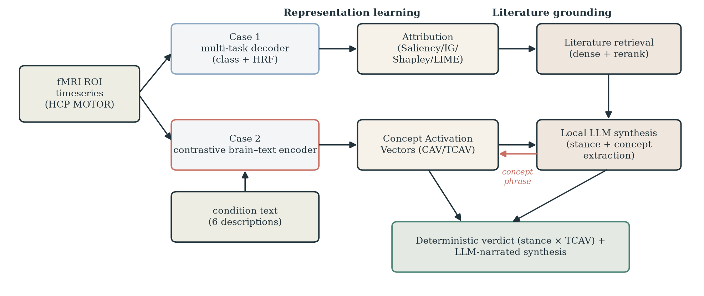
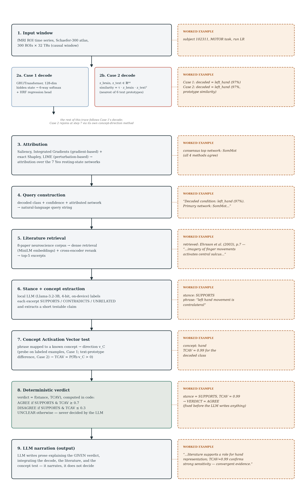
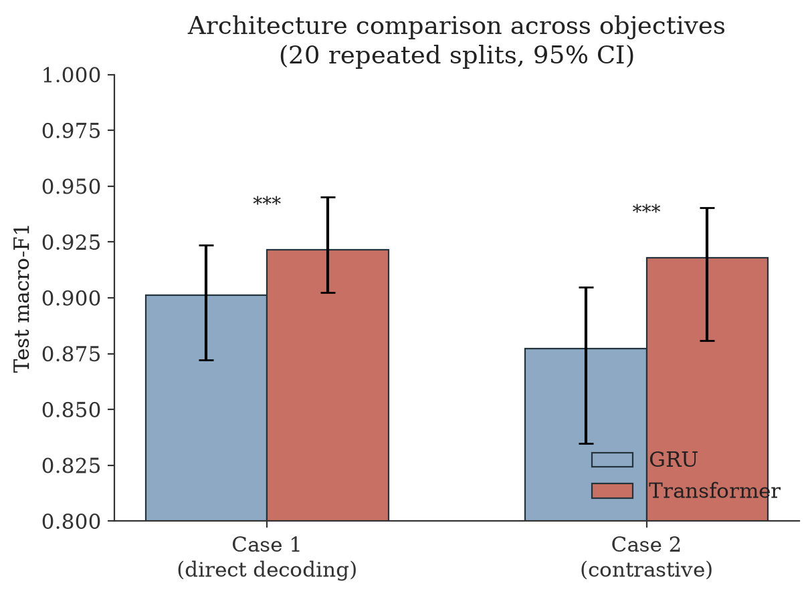
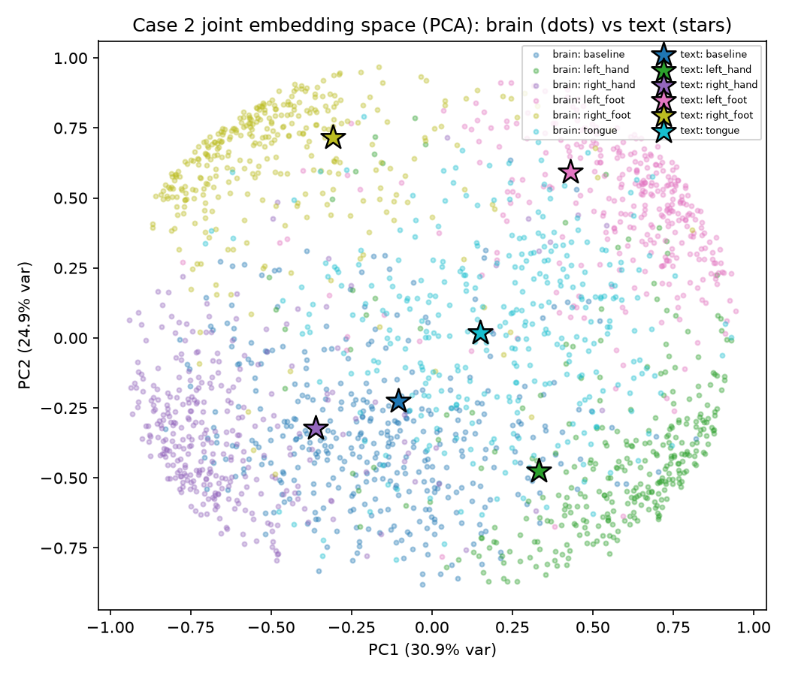
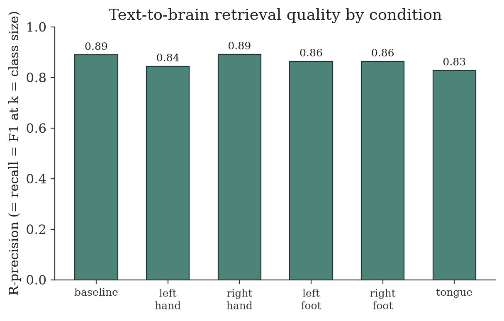
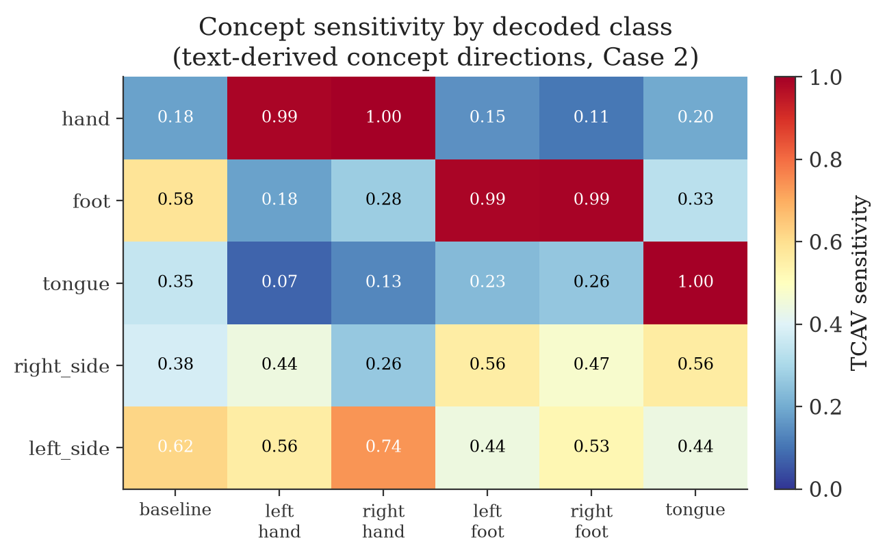
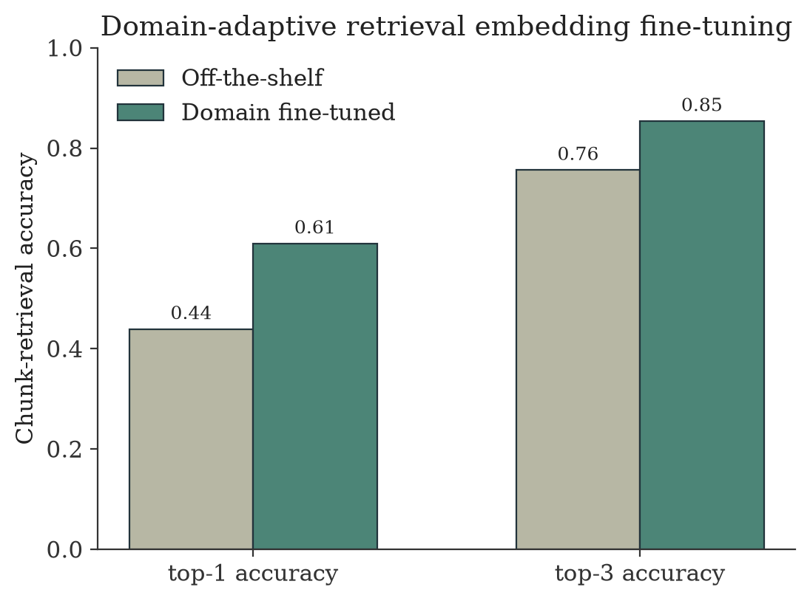

# NeuroLens-RAG: Literature-Grounded Mechanistic Validation of Multimodal Neural Decoders

*A representation-learning and interpretability framework for human fMRI decoding, validated against retrieved neuroscience literature.*

---

## Abstract

Decoding cognitive and motor states from human neuroimaging is conventionally evaluated by classification accuracy alone — a criterion that cannot distinguish a model that has learned neurobiologically meaningful structure from one that exploits an incidental statistical shortcut correlated with the label. This gap is particularly acute for representation-learning approaches, whose internal features are not directly interpretable in domain terms. We present NeuroLens-RAG, a framework for decoding movement conditions from human fMRI (HCP Young Adult, MOTOR task, *n* = 100 subjects, 6 conditions) that pairs three complementary representation-learning objectives with a mechanistic-interpretability and literature-grounding pipeline designed to *test*, rather than assume, whether a learned representation aligns with independent domain knowledge. The first objective is supervised multi-task decoding of movement class and hemodynamic response; the second is a contrastive objective that aligns a brain encoder with a text encoder of the six condition descriptions in a shared embedding space, without any classification head; the third dispenses with class labels entirely, aligning each brain window instead with the hemodynamic response computed from that same window — a genuinely self-supervised objective, evaluated by a linear probe fit after the fact rather than a head trained jointly with the representation. All three were implemented with matched recurrent (GRU) and Transformer backbones and evaluated with population-level statistics — repeated-split resampling and paired non-parametric tests — modeled on established neuroimaging methodology. We then probed what each architecture represents using four complementary attribution methods and Concept Activation Vectors (CAV/TCAV), and closed the loop with a retrieval-augmented generation (RAG) system that retrieves relevant neuroscience literature and tests literature-derived claims directly against each model's internal geometry. The Transformer architecture outperformed the recurrent architecture under both fully-trained objectives (paired Wilcoxon *p* < 10⁻⁸), with the margin roughly doubling under the contrastive objective. Concept-level analysis of the two supervised paradigms showed that effector identity (hand, foot, tongue) is linearly represented with near-ceiling separability in both models, while body-side laterality is represented far more weakly and inconsistently — a result independently reproduced by two unrelated methods for deriving concept directions, one from labeled brain examples and one from unsupervised arithmetic on text embeddings alone. The self-supervised model's post-hoc-probed representation achieved comparable classification accuracy despite using no labels during training, but its concept geometry did not cleanly reproduce the same asymmetry — a genuine complication for the comparison across paradigms that we report and analyze rather than smooth over, and that required extending the TCAV significance test itself to correctly interpret. The literature-grounding pipeline surfaced both convergent evidence (an independently retrieved account of contralateral hand representation matching the models' own concept sensitivity) and informative divergences, motivating a verification procedure that separates a deterministic evidentiary judgment from its natural-language narration. We discuss the generality of this concept-verification framework beyond motor decoding and outline remaining extensions, including a structural-connectivity graph input, a generative text-to-brain decoder, and small-model distillation for efficient deployment.

---

## 1. Introduction

### 1.1 The interpretability gap in neural decoding

Deep networks now decode a wide range of cognitive and motor states from human neuroimaging with high accuracy. Accuracy, however, is a weak witness for representational validity. A classifier that separates "left hand" from "right hand" movement at 95% accuracy has demonstrated that *some* function of its input separates the two classes — not that the function it learned corresponds to the neuroanatomical distinction (contralateral motor cortex organization) a domain expert would invoke to explain the same separation. The two claims are logically independent, and the difference matters: it determines whether a decoder generalizes to related conditions never seen during training, and whether its internal representation can be trusted as a proxy for anything about brain organization, rather than as an opaque but effective correlate of the label.

Closing this gap requires evidence beyond held-out accuracy. Two lines of evidence are useful in combination. The first is *mechanistic interpretability*: does the model's representation organize itself along axes a domain expert would recognize (e.g., effector identity, body-side laterality), and is the model's decision demonstrably sensitive to those axes, rather than merely correlated with them? The second is *independent domain grounding*: does that organization agree with what is already established in the literature, obtained without reference to the model at all? Interpretability alone can confirm a model uses a pre-specified concept; it cannot supply concepts a human did not think to ask about. Literature retrieval alone can supply such concepts; it cannot, by itself, verify that a specific model's representation actually depends on them. The present work integrates both lines of evidence into a single pipeline and evaluates each component on real data.

### 1.2 Approach and scope

NeuroLens-RAG decodes six MOTOR-task conditions (baseline, left/right hand, left/right foot, tongue) from Schaefer-300 parcellated, Yeo-7-network-labeled fMRI time series, using three decoding paradigms trained on a common 100-subject cohort with disjoint train/validation/test/hyperparameter-selection splits at the subject level:

- **Supervised multi-task decoding** — a sequence encoder predicts the movement class and, as an auxiliary objective, the instantaneous hemodynamic response, from a windowed input.
- **Contrastive brain–language representation learning** — a brain encoder and a text encoder of the six condition descriptions are trained jointly to align in a shared embedding space, in the manner of CLIP (Radford et al., 2021), adapted to a small closed vocabulary rather than an open caption set.
- **Self-supervised brain–hemodynamic co-embedding** — a brain encoder and a small hemodynamic-response encoder are trained jointly to align each window with its own concurrent physiological signal, using a symmetric in-batch-negative contrastive loss. No class label enters this objective at any point; a linear probe is fit on the frozen representation afterward, purely for evaluation and for interpretability testing.

All three paradigms were implemented with matched GRU and Transformer backbones, enabling a controlled architecture comparison under each objective. On top of the trained models, we built:

- a four-method attribution suite (two gradient-based, two perturbation-based) identifying which resting-state network drives a given decode;
- a Concept Activation Vector (CAV/TCAV; Kim et al., 2018) procedure that tests whether a model's decision is causally sensitive to a human-specified concept direction in its own representation;
- a retrieval-augmented generation system over a curated corpus of neuroscience papers, coupled to a local instruction-tuned language model; and
- a verification loop in which literature-derived claims, extracted automatically from retrieved text, are converted into concept directions and tested against each model's representation — turning retrieval from a citation lookup into a falsifiable audit of the model.

Every comparative claim in this report is accompanied by population-level statistics (repeated-split resampling, paired non-parametric tests, bootstrap confidence intervals), following the methodological standard set by Misra & Pessoa (2025, *eLife*).

**Figure 1.** Overview of the NeuroLens-RAG pipeline. Three representation-learning objectives (left) share the same fMRI input; each feeds a mechanistic-interpretability stage, which in turn seeds and is tested against literature retrieved by the grounding stage (right). The verification step combines a deterministic evidentiary judgment with a language-model narration of it (§2.7).

**Figure 1b.** Figure 1, elaborated: the same nine-stage pipeline traced through one real decoded window (subject 102311, left-hand movement), with the method used at each stage on the left and the actual intermediate values produced at each stage on the right. Case 2 shares stages 3–9 conceptually but reaches step 7 by its own text-derived route rather than Case 1's labeled-example probe (§2.5). Case 3 (§2.4) reaches step 7 by a third route: a linear probe fit post hoc on its frozen, label-free representation.

---

## 2. Methods

### 2.1 Data

Data were drawn from the Human Connectome Project Young Adult release (S1200), MOTOR task, both phase-encoding directions (LR, RL), for 100 subjects. BOLD time series were parcellated into 300 cortical regions of interest (Schaefer et al., 2018) and labeled by their assignment to one of seven canonical resting-state networks (Yeo et al., 2011): Visual, Somatomotor, Dorsal Attention, Salience/Ventral Attention, Limbic, Control, and Default. Time series were motion-regressed, detrended, and z-scored within run. Subjects were partitioned at the subject level (never at the window level, to prevent leakage across overlapping windows) into 65 training, 13 validation, 12 test, and 10 hyperparameter-selection subjects, the last held out entirely from all reported results.

Two supervisory signals were derived per timepoint: a six-way categorical label (baseline plus five movement conditions) and a five-channel continuous regressor obtained by convolving the task's event timeline with the canonical hemodynamic response function.

### 2.2 Supervised multi-task decoding

Causal windows of 32 TRs (stride 2) were mapped to the class label and hemodynamic regressor at the final timepoint of the window. Both a GRU (hidden size 128) and a Transformer (128-dimensional model, 4 attention heads, 2 layers, sinusoidal positional encoding) encoder were trained with a joint objective, $\mathcal{L} = \mathcal{L}_{\text{CE}}(\hat{y}, y) + \lambda \, \mathcal{L}_{\text{MSE}}(\hat{y}_{\text{HRF}}, y_{\text{HRF}})$ with $\lambda = 0.1$, optimized with AdamW and cosine-annealed learning rate.

### 2.3 Contrastive brain–language representation learning

A second decoding paradigm dispenses with a classification head entirely. A brain encoder (the same GRU/Transformer backbones, with the pooled representation projected to a 64-dimensional embedding) and a text encoder (a frozen pretrained sentence embedding model, MiniLM, with a small trainable linear projection into the same 64-dimensional space) are trained jointly against a temperature-scaled cosine-similarity objective, $\mathcal{L} = \mathcal{L}_{\text{CE}}(\tau \, z_{\text{brain}} z_{\text{text}}^\top, y)$, where $z_{\text{text}}$ is the matrix of the six condition prototypes' embeddings. Because the text side is a small, fixed vocabulary rather than an open per-example caption set, this is a supervised-contrastive, prototype-alignment objective rather than literal in-batch-negative InfoNCE: each brain window is pulled toward its own class's fixed text prototype and pushed away from the other five, with no direct brain-to-brain comparison term.

The trained model was evaluated by (i) prototype-based classification (nearest text prototype by cosine similarity), (ii) cross-modal retrieval (given a condition's text prototype, what fraction of the top-*k* most similar brain windows share that condition), and (iii) a frozen-backbone linear probe forecasting future regional activity from the pooled representation, with a leak-safety constraint requiring the forecast target to remain within the same condition block as the source window.

### 2.4 Self-supervised brain–hemodynamic co-embedding

A third paradigm removes the class label from the training objective entirely. Each brain window is paired not with a text prototype but with the hemodynamic-response vector computed from that same window — a target that is continuous and unique per window, rather than drawn from a small closed vocabulary. This changes what kind of contrastive loss is possible: because both sides of the pair now vary continuously across a batch, every other window in the batch is a genuine negative in both directions, permitting a symmetric loss, $\mathcal{L} = \tfrac{1}{2}\big[\mathcal{L}_{\text{CE}}(\tau\, Z_{\text{brain}} Z_{\text{hrf}}^\top, \mathbf{i}) + \mathcal{L}_{\text{CE}}(\tau\, Z_{\text{hrf}} Z_{\text{brain}}^\top, \mathbf{i})\big]$, where $\mathbf{i}$ is the identity permutation over the batch — the brain→text objective in §2.3 has no such symmetric counterpart, since a text prototype is not a per-example target. The hemodynamic encoder is a small two-layer MLP over the five-channel regressor value at the window's endpoint; the brain encoder reuses the same GRU/Transformer backbones as the other two paradigms.

Because this objective never exposes the model to a label, the trained backbone has no classifier head and cannot itself be evaluated by decoding accuracy or probed by TCAV, both of which require a differentiable, class-conditional output. We address this with a linear probe fit *after* training, on the frozen backbone's pooled features — the standard evaluation convention for self-supervised representations (a "linear probe"), applied here for two purposes at once: it yields a macro-F1 number directly comparable to the other two paradigms' own classifiers, and it supplies the class-conditional logit that the existing CAV/TCAV machinery (§2.5) needs, letting it run on this representation completely unchanged, with no case-specific interpretability code.

### 2.5 Mechanistic interpretability

**Attribution.** Four methods identified which of the seven resting-state networks drove a given decode: Saliency and Integrated Gradients (gradient-based, computed on the continuous 300-ROI input and aggregated by network), and exact Shapley values and LIME (perturbation-based, computed directly on a seven-"player" network-ablation abstraction — small enough that all 2⁷ = 128 coalitions can be enumerated exactly for Shapley, without sampling approximation).

**Concept Activation Vectors.** Following Kim et al. (2018), a concept (e.g., *hand*, *left-side*) is defined by a set of positive and negative example inputs. A linear probe fit on the model's pooled hidden representation separating these examples yields a Concept Activation Vector — the direction along which "concept-ness" increases fastest in the model's own representational geometry. The TCAV score is the fraction of held-out examples for which the directional derivative of a target class's output along this direction is positive: an empirical measure of how often nudging the representation toward the concept would increase the model's confidence in that class, computed without altering the model itself.

For the supervised decoder, concept directions were fit by logistic regression on labeled brain examples. For the contrastive model, which has no classification head, we additionally developed a second, independent method: a concept direction can be derived purely from the difference between two text-prototype embeddings in the model's shared embedding space (e.g., $z_{\text{text}}(\text{left}) - z_{\text{text}}(\text{right})$), then pulled back into the brain encoder's hidden space via the transpose of the trained linear projection — an adjoint-map construction requiring no labeled brain examples whatsoever. Because the contrastive model's shared embedding space also accepts arbitrary free text, we extended attribution itself to the same setting: the similarity between a window's brain embedding and the embedding of *any* sentence (not only the six trained conditions) can be attributed to resting-state networks by exactly the same four methods, substituting the similarity score for a classifier logit. For the self-supervised model (§2.4), concept directions are fit exactly as for the supervised decoder — logistic regression on labeled examples — but on features from a backbone that never used those labels during representation training; only the post-hoc probe head sees them. It cannot support the contrastive model's free-text route, since it has no text modality to embed a phrase into.

**A significance test for a TCAV score.** A single TCAV number does not, by itself, indicate whether a direction is *meaningfully* tied to its intended class rather than incidentally so. We evaluated a null distribution built from directions drawn uniformly at random in the representation's hidden space, on the reasoning that a meaningless direction should score near chance; this failed empirically, returning near-extreme scores for almost any fixed direction, because individual examples' gradients within one class are similar enough that a random direction's sign-agreement with them is dominated by which side of one effective class hyperplane it falls on — a property of the representation's separability, not of the direction's content. The test that worked instead holds a direction fixed and asks whether it ranks its own intended class above the other five, repeated across subject-level bootstrap resamples of the test set, rather than asking whether the direction is unusual among all directions.

### 2.6 Retrieval-augmented literature grounding

A corpus of eight papers spanning task-fMRI methodology, cortical parcellation, and body-part-specific motor representation (including Ehrsson et al., 2003, and Meier et al., 2008) was chunked, embedded with a sentence-transformer, and indexed for dense retrieval, with an optional cross-encoder reranking stage. A locally hosted, quantized instruction-tuned language model (Llama-3.2-3B) performs three roles per decoded window: labeling each retrieved excerpt's stance toward the decode (supporting, contradicting, or unrelated), extracting a specific testable claim from a relevant excerpt (e.g., "hand movement is contralateral"), and producing a final narrative synthesis.

### 2.7 The concept-verification loop

The central methodological contribution of this work is closing the loop between retrieval and interpretability: a claim extracted from literature is mapped, by keyword match, onto one of the concepts the CAV machinery can test, a concept direction is fit or derived as in §2.5, and the resulting TCAV score is compared against the excerpt's stance. Critically, the *evidentiary verdict* — whether the literature and the model's representation agree, disagree, or bear no relation to each other — is computed deterministically from the excerpt's stance and the measured TCAV score, rather than left to the language model's free judgment. An unrelated excerpt yields no comparison (neither agreement nor disagreement is defined); a supporting excerpt paired with high concept sensitivity yields agreement; a supporting excerpt paired with low concept sensitivity yields a genuine, flagged disagreement. The language model's role is restricted to narrating this already-determined verdict in readable prose, integrating it with the decoded result and the retrieved text — a separation of a falsifiable, reproducible judgment from a fluent but non-authoritative narration of it.

### 2.8 Statistical framework

Every comparative claim is backed by population-level resampling rather than a single train/test split, following Misra & Pessoa (2025, *eLife*): repeated random re-partitioning of the subject pool (20–30 repeats, an empirical stopping rule requiring the running confidence interval to stabilize), paired designs when comparing two architectures on identical resampled splits (enabling a Wilcoxon signed-rank test on per-repeat differences), and post-hoc bootstrap resampling of the test-subject composition for a fixed trained model, reported alongside the repeated-split estimate.

---

## 3. Results

### 3.1 Decoding performance and architecture comparison

Both fully-trained decoding paradigms reached high performance on the held-out test set: 92.0% test macro-F1 (95% CI [90.9, 93.4], 20 repeated splits) for supervised decoding, and 91.8% (95% CI [88.1, 94.0], 20 repeated splits) for the contrastive paradigm's prototype classification. A controlled comparison of the two backbones under both objectives (**Figure 2**) showed the Transformer architecture significantly outperforming the recurrent architecture in both cases (paired Wilcoxon *p* < 4 × 10⁻⁹ for both), with a substantially larger margin under the contrastive objective (+4.1 percentage points) than under direct supervised decoding (+2.0 percentage points) — the contrastive training signal appears to reward the Transformer's inductive bias more than plain classification does. The self-supervised paradigm (§2.4) is evaluated separately, in §3.4, since it has not yet received the same repeated-split treatment (§4.3).

**Figure 2.** Test macro-F1 for GRU and Transformer backbones under both decoding objectives, with 95% confidence intervals from 20 repeated subject-level resamples. Asterisks denote a paired Wilcoxon signed-rank test on per-repeat differences (*** *p* < 0.001).

### 3.2 Structure of the contrastive representation

Because retrieval-based evaluation can be perfect even when a joint embedding space merely ranks correctly without genuinely intermixing modalities (a "modality gap," Liang et al., 2022), we evaluated the contrastive model's shared space directly rather than relying on classification accuracy alone. A two-dimensional projection of brain-window embeddings and the six text prototypes (**Figure 3**) shows each text prototype situated within its corresponding class's brain-embedding cluster, rather than in a separate region of the space. This qualitative impression was confirmed quantitatively: the ratio of mean cross-modal to mean within-modality embedding distance was 1.01 (no systematic offset between modalities), and a silhouette score computed on brain embeddings alone, with text entirely excluded, was 0.43 — evidence that the brain encoder organizes windows by condition on its own, rather than merely inheriting apparent structure from proximity to fixed text anchors.

{width=70%}

**Figure 3.** Principal-component projection of the shared brain–text embedding space. Dots are individual brain-window embeddings (colored by true condition); stars are the six condition text prototypes.

Text-to-brain retrieval quality, summarized by R-precision — the point at which precision, recall, and F1 coincide, avoiding the systematic underestimate of recall that a fixed small *k* produces against a much larger true-class pool — ranged from 0.83 to 0.89 across conditions (**Figure 4**), consistent with the model's classification-level accuracy.

{width=65%}

**Figure 4.** Text-to-brain retrieval R-precision by condition.

### 3.3 Concept sensitivity of the learned representations

Concept Activation Vector analysis was performed on both decoding paradigms for five concepts: effector identity (*hand*, *foot*, *tongue*) and body-side laterality (*left-side*, *right-side*). For the supervised decoder, concepts were fit from labeled brain examples via logistic regression on the pooled representation (probe accuracy 98.5–99.9%). For the contrastive model, the same five concepts were instead derived purely from differences between text-prototype embeddings, with no labeled brain examples used at any stage (**Figure 5**).

{width=75%}

**Figure 5.** TCAV sensitivity of each decoded class to five concept directions, derived entirely from text-prototype arithmetic (contrastive model). Values are the fraction of held-out examples of the given class for which the model's decision is directionally sensitive to the concept.

Effector identity was represented with near-ceiling linear separability by both methods and both architectures: the *hand* concept showed TCAV sensitivity of 0.98–1.00 for left- and right-hand decodes and 0.11–0.20 for all other classes; *foot* and *tongue* showed an analogous pattern. Body-side laterality was represented far more weakly and less cleanly: TCAV sensitivity for the matching-laterality class ranged only 0.44–0.74, with substantial off-target sensitivity for classes that have no laterality (baseline, tongue) that are not part of either the positive or negative set used to define the concept. This asymmetry — clean, near-binary encoding of *which effector*, diffuse encoding of *which side* — was obtained independently via two methods that share no data or fitting procedure (a supervised probe on brain examples for the multi-task decoder; unsupervised text arithmetic for the contrastive model), which is stronger evidence that it reflects a genuine property of what these models learn from this task and cohort size, rather than an artifact particular to either derivation method.

### 3.4 Case 3: the self-supervised representation

The self-supervised paradigm's post-hoc linear probe (§2.4) reached 91.6% (GRU) and 91.7% (Transformer) test macro-F1 on a single held-out split — within a point of both fully-trained, label-supervised paradigms (92.0%, 91.8%), despite never using a class label anywhere in representation training. Same-window brain–hemodynamic co-occurrence alone recovers nearly all of the linearly-decodable task structure that direct supervision provides; this single-split result has not yet been re-run under the repeated-split protocol used for the other two paradigms (§4.3) and should be read as a strong preliminary result, not a population-level estimate.

The same five concepts (§3.3) were fit on this representation using the identical labeled-example probe method as the supervised decoder — the only method available, since this paradigm has no text modality (§2.5). Probe accuracy was 98.9–99.3%, matching or exceeding the two label-supervised paradigms across all five concepts, including laterality. We examine what this means for the effector/laterality asymmetry directly in §3.5, rather than reporting the number in isolation.

### 3.5 Reconciling concept sensitivity across three representations

§3.3 reported the report's most substantive single finding to that point: effector identity is cleanly represented while body-side laterality is not, replicated by two methods that share no fitting procedure. The natural next question, raised by adding a third paradigm, is whether this asymmetry replicates a third time. It does not, straightforwardly — and the reason why is itself informative.

Case 3's probe accuracy is near-ceiling for *all five* concepts, laterality included, not just the effector concepts. Read naively, this could be reported as "Case 3 represents laterality better than the other two paradigms." That reading does not survive the significance test built for exactly this kind of question (§2.5): applying the cross-class rank-bootstrap test to Case 3's concepts revealed that several classes' TCAV scores saturate at the 1.0 ceiling *simultaneously* under a single fixed direction — not just the concept's own intended class. TCAV's underlying score is binarized (the fraction of examples with a positive directional derivative), so once a representation is separable enough, multiple classes can hit the same ceiling value at once, and asking "does the intended class rank #1" degenerates toward a coin flip among the tied classes rather than testing anything about the direction's specificity. (This also caught a real bug in the significance test's own tie-breaking logic — §4.3 discusses it as a limitation in its own right, not only as a fact about Case 3.) So the honest statement is not "Case 3 solves laterality," but: *Case 3's overall representation is more linearly separable for arbitrary post-hoc binary questions than either label-supervised representation, and this uniform separability leaves TCAV's binarized score with little room to discriminate a concept's specific relevance from the general fact that almost anything is separable here.*

One further asymmetry survives even this caveat. The `left_side` concept in Case 3 extrapolates its direction onto classes that were never part of its positive or negative training set (`baseline`, `tongue`) — the identical extrapolation artifact already documented for the supervised decoder in Case 1. `right_side`, tested the same way, shows no such leakage. That a training-time artifact first identified in one paradigm reappears, asymmetrically between left and right, in an architecturally different, differently-supervised third paradigm is more informative than either paradigm's raw TCAV number alone: it suggests the artifact reflects something about how laterality is distributed across this cortical parcellation and this task, not an idiosyncrasy of one probe-fitting procedure.

Whether the overall three-case comparison "does justice" to the CAV/TCAV methodology, then, has a two-part answer. The interpretability *mechanism* generalized cleanly: `run_concept_analysis` ran unmodified against a representation trained under an objective it was never designed for, requiring only a linear-probe wrapper, not new interpretability code. The significance-*testing* layer did not survive contact with Case 3 unmodified — it required a real fix (§4.3) once tested against a representation whose separability profile differed qualitatively from the two it was validated on. We report both halves rather than only the first, since a methodology that is only ever tested against representations shaped like the ones it was built on has not yet been tested very hard.

### 3.6 Literature-grounded concept verification

The verification loop (§2.7) was run on real decoded windows, with retrieved excerpts from the literature corpus converted into concept claims and tested against each model's own representation. In one representative case, a window decoded as left-hand movement showed TCAV sensitivity of 1.0 to both the *hand* and *left-side* concepts, converging with an independently retrieved account of contralateral hand representation (Ehrsson et al., 2003) — two lines of evidence, neither informed by the other, arriving at the same conclusion. In other cases, the loop correctly identified that a retrieved excerpt's claim was unrelated to the concept actually driving a given decode, yielding a null result that the verification procedure records as evidentially uninformative rather than as a disagreement — a distinction that matters because the two have different implications (an uninformative test says nothing about the model; a genuine disagreement flags a specific, checkable discrepancy between the model's representation and a documented claim).

### 3.7 Component-level evaluation of the generation pipeline

Three components of the retrieval-and-generation pipeline were evaluated and, where beneficial, improved. First, retrieval quality was measured on a held-out set of paraphrased queries requiring retrieval of one specific passage from an 880-chunk corpus containing many near-duplicate, topically overlapping chunks — a substantially harder benchmark than paper-level relevance, which saturates at this corpus size. Domain-adaptive contrastive fine-tuning of the retrieval embedding model on a small set of in-domain query–passage pairs improved chunk-retrieval accuracy from 43.9% to 61.0% (top-1) and from 75.6% to 85.4% (top-3) (**Figure 6**). Second, a query-refinement procedure that steers a second retrieval pass toward whichever literature-derived concept the model is measurably most sensitive to increased the retrieved passage's estimated relevance score consistently, though the small (eight-paper) corpus size meant the top-ranked passage itself did not change — an expected ceiling effect at this corpus scale rather than a failure of the technique. Third, supervised fine-tuning of the local generation model on a small set of examples targeting a specific reasoning distinction (whether an unrelated excerpt constitutes a genuine disagreement) improved the model's reliability at producing a required output format, but did not reliably transfer the underlying discrimination itself at this training scale — motivating the deterministic verification design of §2.7, which does not depend on this discrimination being learned by the generation model at all.

{width=65%}

**Figure 6.** Chunk-level retrieval accuracy before and after domain-adaptive contrastive fine-tuning of the retrieval embedding model.

---

## 4. Discussion

### 4.1 A general framework for validating learned neural representations

The central claim of this work is methodological: accuracy-only evaluation and interpretability-only evaluation are each individually insufficient for establishing that a decoding model's representation is neurobiologically meaningful, and retrieval-augmented literature grounding closes a specific part of the remaining gap — supplying candidate concepts a researcher did not have to enumerate in advance, drawn from the accumulated findings of the field rather than from the model itself. The verification loop developed here (§2.7) demonstrates that this integration is tractable with entirely open, moderately sized models and a modest literature corpus, and that its outputs are falsifiable: a retrieved claim either does or does not survive contact with the model's measured internal sensitivity, and the two possible outcomes are distinguishable from a third, uninformative outcome (claim and model concept simply do not overlap).

### 4.2 The effector/laterality asymmetry as a substantive finding — and its limits

The consistent, cross-method finding that effector identity is represented far more cleanly than body-side laterality, under the two label-supervised paradigms, is, we believe, the most substantive empirical result in this report. It was obtained under two decoding objectives, two architectures, and — for the contrastive model — two entirely independent ways of deriving a concept direction (supervised probing versus unsupervised prototype arithmetic), none of which shared a fitting procedure. This convergence argues against the asymmetry being a probing artifact specific to any one method, and raises a genuine question for further investigation: whether it reflects a property of the training data and task design at this subject count, or a more general property of how spatial-laterality information is distributed across the sampled cortical parcellation relative to effector-identity information.

Adding the self-supervised paradigm (§3.4–3.5) complicates rather than simply reinforces this picture, and we take that complication seriously rather than reporting only the two paradigms that agree. Case 3's representation is uniformly more separable than either label-supervised one across *all* tested concepts, laterality included, which limits how much TCAV's binarized score alone can say about that representation's specificity — a genuine boundary condition on the method, discovered only because a third, differently-shaped representation was tested against it (§4.3). What does survive across all three paradigms is a specific extrapolation artifact in the `left_side` concept (§3.5), which is arguably better evidence of a real, task-level phenomenon than a third repetition of the original asymmetry would have been, precisely because it appeared in a representation trained under a completely different objective.

### 4.3 Limitations

The attribution methods used here disagree with each other more often across families (gradient- versus perturbation-based) than within a family, and this disagreement remains unresolved rather than adjudicated. The literature corpus is small (eight papers); both retrieval quality and the diversity of concepts available for verification would be expected to improve with a larger, more systematically curated corpus. The mapping from an extracted literature phrase to a specific testable concept remains keyword-based rather than semantically matched, a simplification that constrains which literature claims can currently be operationalized as tests. Text-conditioned attribution, while functional, did not sharply discriminate between two substantively different query texts evaluated on the same window in our qualitative check, suggesting it is better suited to broad network-level questions than fine discrimination between closely related candidate concepts at present.

The self-supervised paradigm's headline numbers (§3.4) come from a single held-out split, not the repeated-resampling protocol applied to the other two paradigms — a direct comparison of confidence intervals is not yet possible, and the reported macro-F1 should be read as a strong preliminary result pending that treatment. Its concept-testing significance layer surfaced a real defect in our own methodology, not just a property of the data: our rank-based TCAV significance test originally broke ties between classes tied at a saturated score using an implicit lowest-index rule, which would have silently misreported several of Case 3's concepts as null findings had it not been caught by noticing the pattern tracked class index rather than concept meaning. It is now fixed (ties broken uniformly at random, with a diagnostic reporting how often ties occurred), but the deeper limitation remains: the test's binarized TCAV score loses discriminating power exactly in the high-separability regime Case 3 turned out to occupy, and a continuous, magnitude-based variant would likely be needed to say more than we currently can about that regime.

### 4.4 Future directions

The self-supervised brain–hemodynamic paradigm proposed in an earlier version of this work is now built and reported (§2.4, §3.4–3.5); the remaining planned work has shifted accordingly. First, all three paradigms are queued for retraining on an expanded 200-subject cohort (data collection in progress at time of writing) under the same repeated-split protocol, together with a capacity sweep across GRU depth and Transformer heads/layers, and a re-measurement of every concept direction under the corrected significance test — closing the population-level gap noted in §4.3 for Case 3 specifically. Second, a generative decoder mapping a point in a shared embedding space — potentially a concept-nudged point, rather than only a condition prototype — back to a synthesized pattern of regional activity, which would allow a concept's predicted neural signature to be inspected directly rather than only summarized by a scalar sensitivity score; evaluating a generative model's concept-sensitivity is a genuinely different problem from the discriminative case handled throughout this report and remains explicitly out of scope until the discriminative comparison is complete. Third, a structural-connectivity graph, derived from diffusion imaging already available for the great majority of the eligible cohort, as an additional graph-structured input feeding the existing sequence encoders — motivated by the current architectures' lack of any explicit anatomical prior. Fourth, knowledge distillation of the supervised decoder into a substantially smaller student model, isolating what a soft-label training signal contributes beyond what the same small architecture achieves on hard labels alone, motivated by eventual real-time or resource-constrained deployment.

---

## 5. Conclusion

NeuroLens-RAG demonstrates that mechanistic interpretability and literature-grounded verification can be combined into a single, reproducible pipeline for auditing what a neural decoding model has actually learned, applied here to three complementary representation-learning objectives — spanning supervised, supervised-contrastive, and self-supervised training regimes — on human motor-task fMRI. Beyond establishing that a Transformer architecture significantly outperforms a recurrent one under both fully-trained objectives, and that a self-supervised objective recovers comparable decoding accuracy without ever using a label, the framework surfaced a cross-validated finding about the asymmetric fidelity of effector versus laterality representation under supervision, showed that this finding does not trivially extend to a self-supervised representation with a qualitatively different separability profile, and used that very complication to expose and fix a real limitation in its own significance-testing methodology. It also showed that literature-derived hypotheses can be tested against a model's internal geometry with a verification procedure whose evidentiary conclusions do not depend on trusting a language model's free-form judgment. We regard this integration — and its willingness to report where the comparison across paradigms gets genuinely harder, not just where it agrees — as the primary contribution of the present work.

---

## Appendix: Project summary for a technical audience

| Component | Approach |
|---|---|
| Decoding objectives | Supervised multi-task classification + HRF regression; CLIP-style contrastive brain–text alignment; self-supervised brain–hemodynamic co-embedding with a post-hoc linear probe |
| Architectures compared | GRU, Transformer (matched capacity), statistically compared via paired resampling (self-supervised paradigm: single-split so far, §4.3) |
| Interpretability | 4-method attribution (Saliency, Integrated Gradients, exact Shapley, LIME); Concept Activation Vectors (CAV/TCAV) across all three paradigms, including a text-derived, brain-example-free variant unique to the contrastive model; a cross-class rank-bootstrap significance test for TCAV scores |
| Literature grounding | Dense + cross-encoder-reranked retrieval over a curated neuroscience corpus; local instruction-tuned LLM for stance labeling, claim extraction, and narration |
| Verification | Deterministic evidentiary scoring (stance × TCAV) decoupled from LLM narration |
| Statistical framework | Repeated subject-level resampling, paired non-parametric tests, bootstrap CIs, following Misra & Pessoa (2025, *eLife*) |

### Resume-ready summary points

- Designed and validated three complementary representation-learning objectives — supervised multi-task decoding, CLIP-style contrastive brain–language alignment, and self-supervised brain–hemodynamic co-embedding — for 6-class movement decoding from human fMRI across 100 subjects, establishing statistically significant architecture effects (Transformer > GRU, paired Wilcoxon *p* < 10⁻⁸) via population-level, repeated-resampling evaluation rather than single-split accuracy.
- Showed a self-supervised representation trained with zero class-label supervision reaches within 1 point of two fully-supervised paradigms' macro-F1 (91.6–91.7% vs. 91.8–92.0%) via a post-hoc linear probe, and re-used an existing labeled-example CAV/TCAV interpretability pipeline on it unchanged by exposing the same probe interface.
- Built a four-method mechanistic interpretability suite (gradient- and perturbation-based attribution; Concept Activation Vectors) and used it to identify a reproducible, cross-architecture, cross-method asymmetry between effector-identity and body-laterality representation — including an interpretability method requiring no labeled examples, derived instead from arithmetic in a learned multimodal embedding space — then stress-tested that finding against a third, self-supervised representation and reported honestly where it did and didn't hold.
- Diagnosed and fixed a tie-breaking defect in a custom TCAV significance test that would have silently misreported null findings under representation saturation, catching it before publication by noticing the failure pattern tracked an implementation detail (class index) rather than the underlying science.
- Designed and implemented a retrieval-augmented generation system that converts literature-derived scientific claims into falsifiable tests of a model's internal representation, with a verification procedure that separates a deterministic evidentiary judgment from a language model's narrative explanation of it.
- Applied and extended established neuroimaging statistical methodology (repeated subject-level resampling, paired non-parametric significance testing, bootstrap confidence intervals) to a deep-learning decoding pipeline, matching a peer-reviewed methodological standard.
- Evaluated and improved individual components of a local, fully on-device language-model pipeline (retrieval embeddings, retrieval reranking, generation fine-tuning), quantifying which interventions transferred and which did not.
