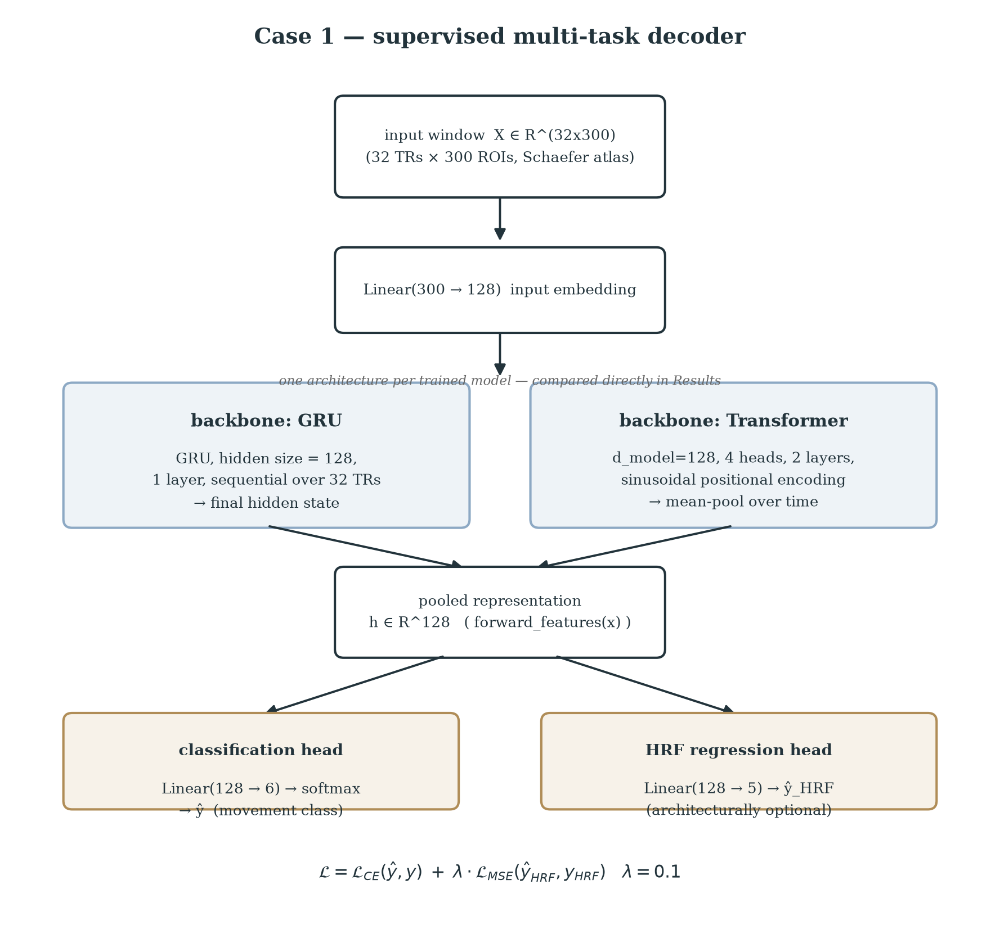
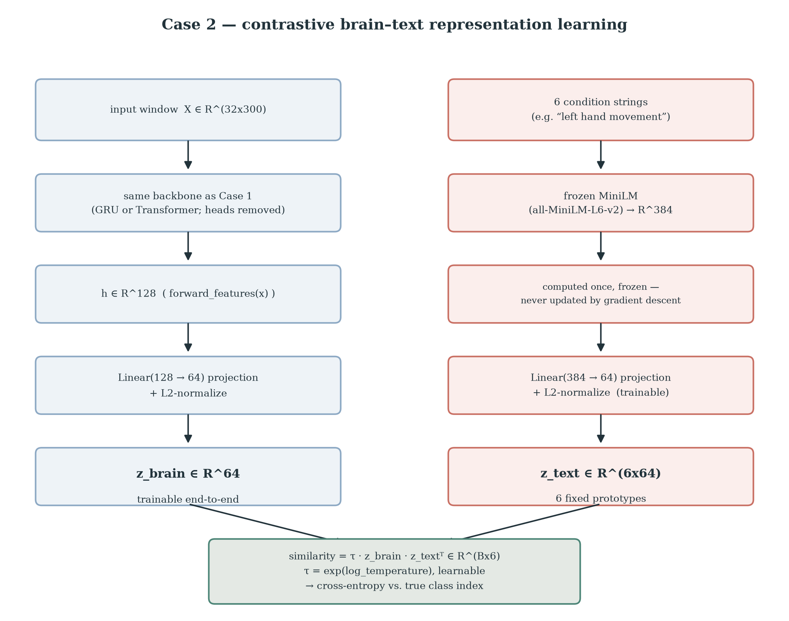
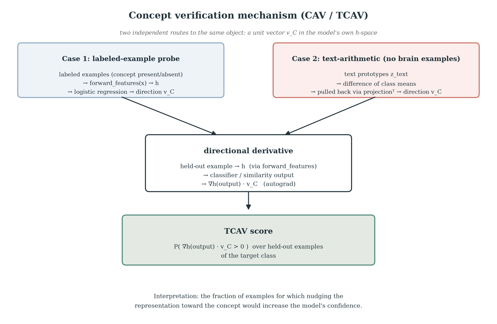
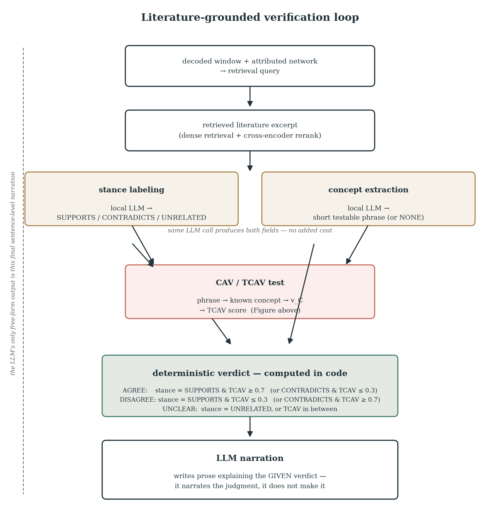

# NeuroLens-RAG: Multi-Model Representation Learning with Literature-Grounded Mechanistic Validation

> The single, top-level entry point for the project. Written in paper form (Introduction, Methods, Results, Discussion) rather than as a code walkthrough, so it reads as a scientific summary, not a change-log. Component docs go deeper on each piece: [case1-summary-report.md](case1-summary-report.md), [case2-3-design-plan.md](case2-3-design-plan.md), [interpretability-methods-notes.md](interpretability-methods-notes.md), [population-level-evaluation-plan.md](population-level-evaluation-plan.md), [decoded-state-to-text-report.md](decoded-state-to-text-report.md).

## Abstract

Decoding accuracy alone cannot distinguish a model that has learned real neurobiological structure from one that has learned a shortcut correlated with the label. This project decodes movement conditions from human fMRI (HCP MOTOR task, 100 subjects) using two complementary representation-learning objectives — supervised multi-task decoding and contrastive brain-language alignment — and then asks the harder question: *what did the model actually learn, and is that consistent with independent domain knowledge?* Four attribution methods and Concept Activation Vectors (CAVs) probe the model's internal representation directly; a retrieval-augmented generation (RAG) system grounds that probing in real neuroscience literature rather than a hand-picked concept list; and every headline claim is backed by population-level bootstrap statistics rather than a single training run. The result is a closed loop — literature generates falsifiable hypotheses about the model, and CAV testing checks them against the model's actual internals — that neither retrieval nor interpretability could produce alone.

## 1. Introduction

### 1.1 Motivation

A model that decodes hand-vs-foot movement from fMRI at 92% accuracy has *not* thereby demonstrated it represents "hand" and "foot" the way a neuroscientist means those terms — it has demonstrated that a linear or attention-weighted function of the input separates the classes well. These are different claims. The gap between them matters practically (does a decoder generalize to slightly different conditions?) and scientifically (can we trust the model's internal representation as a proxy for anything about brain organization?). Closing that gap requires evidence beyond accuracy: does the representation organize itself along axes a domain expert would recognize, and does that organization agree with what's already published about the domain?

### 1.2 Scope

The project has two decoding "Cases," a shared interpretability layer, and a literature-grounding layer:

- **Case 1** — supervised multi-task decoding: `X → y` (movement class) and `X → y_hrf` (auxiliary continuous hemodynamic-response regression), via GRU or Transformer encoders.
- **Case 2** — contrastive representation learning: a brain encoder and a text encoder (of the condition description) trained to align in a shared embedding space, CLIP-style, evaluated via prototype classification, cross-modal retrieval, and linear-probe forecasting.
- **Interpretability**: four independent attribution methods (gradient- and perturbation-based) plus Concept Activation Vectors (CAVs), which test whether the model's representation is organized along human-interpretable concept directions.
- **RAG-CAV loop**: real neuroscience literature is retrieved, an LLM extracts candidate concept claims from it, and those claims are tested directly against the model via CAVs — turning retrieval from a citation lookup into a mechanistic audit.
- **Statistical validation**: every comparative claim (architecture A vs. B, metric X's confidence interval) is backed by population-level resampling, modeled on a published methodological standard (Misra & Pessoa, 2025, *eLife*), not a single split.

**Case 3** — a discriminative brain–HRF co-embedding, aligning the brain encoder with the *same window's* hemodynamic-response signal in a shared space, the same way Case 2 aligns brain and text — is scoped (§4.3) but not yet built. (A separate, earlier-considered idea — a Bayesian dynamical-systems model, SLDS/rSLDS — is a distinct, still-unscoped direction; it is not what "Case 3" refers to going forward, to avoid the two ideas colliding under one name.)

## 2. Methods

### 2.1 Data

HCP Young Adult S1200, MOTOR task, LR+RL runs, 100 subjects (scaled from an initial 5 → 20 → 100 over the project, each subject verified against S3 before download). Schaefer-300 cortical atlas, 7-network (Yeo) parcellation. Preprocessing: motion regression, detrending, within-run z-scoring. Targets: a 6-class hard label (baseline + 5 movement conditions) and a 5-channel canonical-HRF-convolved continuous regressor built from the task's own event files. Subject-level splitting throughout (never window-level, to avoid leakage from overlapping windows): 10 subjects reserved for hyperparameter selection only, 65/13/12 train/val/test over the remaining 90.

### 2.2 Case 1 — multi-task decoding

32-volume causal windows (stride 2), `X[t-31:t] → y[t], y_hrf[t]`. GRU (hidden=128) or Transformer (d_model=128, 4 heads, 2 layers) encoder, pooled representation feeding a classification head and an *architecturally optional* HRF regression head (removed entirely, not just untrained, for classification-only ablations). Loss: `cross_entropy(y) + λ_hrf · mse(y_hrf)`, `λ_hrf=0.1`.

**Figure.** Case 1's supervised multi-task decoder: a shared backbone (GRU or Transformer, compared in §3.3) pools a window into `h ∈ R^128`, feeding independent classification and HRF-regression heads.

### 2.3 Case 2 — contrastive brain-language representation learning

A brain encoder (same GRU/Transformer backbones, heads removed) projects to a `d=64` embedding `z_brain`. A text encoder embeds each of the 6 condition descriptions once via a frozen pretrained sentence embedding model (MiniLM), with only a small trainable projection on top — appropriate given there are only 6 fixed text targets, not enough signal to learn a text encoder from scratch. Training: temperature-scaled cosine-similarity cross-entropy against all 6 known prototypes (a supervised-contrastive variant, not literal in-batch-negative InfoNCE, since the text side is a small closed vocabulary rather than CLIP's open per-example caption set — see §2.1 of `case2-3-design-plan.md` for the precise distinction). Evaluated via prototype-based classification (nearest text-prototype by cosine similarity), text-to-brain retrieval, and — via a frozen-backbone linear probe — forecasting of future ROI activity at increasing horizons, with a leak-safety constraint requiring the forecast target to share the source window's condition label (preventing a forecast from silently crossing into an adjacent condition block).

**Figure.** Case 2's contrastive brain-text architecture: the same backbone as Case 1 (heads removed) projects to `z_brain ∈ R^64`; a frozen sentence-embedding model plus a small trainable projection produces `z_text ∈ R^(6x64)`; training aligns the two via a temperature-scaled similarity cross-entropy.

### 2.4 Interpretability

**Attribution** (which resting-state network drove a decode): Saliency and Integrated Gradients (gradient-based, via Captum) and exact Shapley values and LIME (perturbation-based), all pooled to the 7 Yeo networks — pooling to 7 "players" is what makes *exact* (non-sampled) Shapley-value computation tractable (128 coalitions enumerated exhaustively).

**Concept Activation Vectors (CAV/TCAV, Kim et al. 2018)**: given labeled positive/negative example inputs for a concept, fit a linear probe in the model's pooled representation to find the direction separating them (the CAV), then measure the directional derivative of a target class's logit along that direction for held-out examples — the fraction with a positive derivative is the TCAV score, i.e. "how often would nudging this representation toward the concept increase the model's confidence in this class." See §3 below for the worked example and diagram.

**Figure.** The two independent routes to a concept direction `v_C` — a labeled-example probe (Case 1) and text-prototype arithmetic (Case 2, no brain examples needed) — converge on the same directional-derivative test in the model's own hidden space.

### 2.5 Retrieval-augmented generation and the RAG-CAV loop

A corpus of 8 papers — deliberately including genuine neuroscience hypothesis papers (Ehrsson et al. 2003 on body-part-specific motor imagery; Meier et al. 2008 on non-classical motor cortex organization), not only infrastructure papers — is chunked, embedded (MiniLM), and optionally reranked with a cross-encoder before being passed to a local, quantized LLM (Llama-3.2-3B via Apple's MLX framework, entirely on-device). The LLM performs three roles in sequence: (1) label each retrieved excerpt SUPPORTS/CONTRADICTS/UNRELATED to a decoded state, (2) extract a candidate concept phrase from a relevant excerpt, and (3) synthesize a final explanation integrating the decode, the literature, and an independent CAV test of whether the model's decision is actually sensitive to the extracted concept. Step 2→3 is the loop: a phrase is mapped (currently via keyword matching, §3.3 discusses the tradeoff) onto a concept the CAV machinery can test, closing the gap between "the literature says X" and "does the model's representation actually reflect X."

**Figure.** The literature-grounded verification loop in its current (Case 2) form: stance labeling and concept extraction happen in one LLM call, the concept is tested via CAV/TCAV, and the agree/disagree/unclear verdict is computed deterministically from the stance and TCAV score rather than decided by the LLM (§3.6). The LLM's only free-form output is the final narration.

### 2.6 Statistical validation

Modeled on Misra & Pessoa (2025, *eLife*)'s methodology: subject-level (not data-point-level) resampling, an empirical stopping rule (add resamples in batches until the confidence interval stabilizes, rather than fixing a count in advance), and — for architecture comparisons — a *paired* design (both architectures trained on the identical resampled split each repeat) enabling a Wilcoxon signed-rank test on the per-repeat differences. One disclosed deviation: repeated random re-partitioning was used instead of literal with-replacement bootstrap, because the data-loading infrastructure de-duplicates by subject, making weighted resampling a no-op without further code changes (§population-level-evaluation-plan.md).

## 3. Results

### 3.1 Case 1

| Metric | Value |
|---|---|
| Single 100-subject split, Transformer | 91.3% test macro-F1 |
| Population-level (20 repeated splits) | **92.0%**, 95% CI [90.9%, 93.4%] |
| Post-hoc bootstrap (test-subject resampling, fixed model) | 92.6%, 95% CI [90.9%, 94.2%] — wider than the repeated-splits CI, explained below |

### 3.2 Case 2

| Metric | Value |
|---|---|
| Official-split, Transformer | 90.8% test macro-F1 |
| Post-hoc bootstrap (test-subject resampling, fixed model) | 90.8%, 95% CI [88.0%, 93.3%] |
| Text-to-brain retrieval, R-precision (= recall = F1 at k = class size) | **0.83–0.89** across the 6 classes |
| Forecasting horizon (frozen representation, linear probe) | Real signal ~3–4 seconds (4–6 TRs), decaying to noise beyond |
| Modality-gap check (cross-modal / within-brain distance ratio) | **1.01** — brain and text embeddings are exactly as close to each other as brain embeddings are to each other |
| Brain-only silhouette score (class labels, text ignored) | 0.43 — real class structure independent of the text anchors |

**Retrieval quality, corrected**: an earlier version of this report cited "precision = 1.00 at every k from 5–50" as the text-to-brain retrieval result. That number is real but misleading on its own — with ~470–580 true-class windows per class in the test set, retrieving only the top 5–50 necessarily caps *recall* at 1–10%, however good the ranking is; precision alone cannot reveal that. `text_to_brain_retrieval_metrics()` (`src/neurolens/contrastive.py`) now reports precision, recall, and F1 together at each k, and R-precision (precision evaluated at k = the true class size, the point where precision, recall, and F1 necessarily coincide) gives the single honest summary number: **0.83–0.89 across the 6 classes** — strong, consistent with the ~90% classification macro-F1, but not the artificially perfect 1.00 the precision-only view implied.

Retrieval precision alone also can't distinguish genuine cross-modal mixing from a "modality gap" (Liang et al., 2022) — two well-aligned-for-ranking but geometrically separate clouds. Three diagnostics were run to check directly: a cross-modal/within-modality distance ratio (1.01, i.e. no systematic offset), a brain-only silhouette score (0.43, i.e. real intrinsic class structure, not borrowed from the text prototypes), and a PCA visualization (`results/case2_embedding_space_pca.png`) showing each text prototype sitting inside its matching-class brain cluster rather than in a separate region. All three agree: the space is genuinely mixed, not just well-ranked. (One secondary check — a linear probe classifying brain-vs-text from the embedding alone — hit 100% accuracy, but this is a statistical artifact of comparing 6 text points against thousands of brain points with no possible held-out split, not evidence of a real gap; reported for completeness, not trusted on its own.)

### 3.3 Architecture comparison — GRU vs. Transformer, paired significance test

| | GRU | Transformer | Paired Wilcoxon p |
|---|---|---|---|
| Case 1 | 0.901 [0.872, 0.924] | **0.922 [0.902, 0.945]** | 3.7×10⁻⁹ |
| Case 2 | 0.877 [0.835, 0.905] | **0.918 [0.881, 0.940]** | 1.9×10⁻⁹ |

Transformer is statistically significantly better for both objectives, with roughly double the margin under the contrastive objective (+4.1 points) versus direct decoding (+2.0 points) — the contrastive setup rewards the Transformer's architecture more than plain supervised classification does.

**A methodologically informative discrepancy**: Case 1's post-hoc bootstrap CI (§3.1) is *wider* than its repeated-splits CI, despite using one fixed model rather than 20 independently retrained ones. This is not evidence the model is less reliable — with only 12 test subjects, with-replacement resampling from such a small discrete pool has inherently high sampling variance (a single resample can lose several subjects entirely or triple-count one), independent of model quality. The reference paper bootstrapped 92 participants; a much larger pool damps exactly this effect. The repeated-splits estimate, which draws from the full 90-subject pool each time, is the more trustworthy of the two at this subject count.

### 3.4 Interpretability

The four attribution methods split into two internally-consistent clusters (gradient-based: Saliency/IG, ~97% mutual top-1 agreement; perturbation-based: Shapley/LIME, ~97%) that agree with each other only ~78% of the time across families — gradient methods systematically over-weight the Default network relative to perturbation methods, which concentrate on SomMot (the neuroanatomically expected answer for MOTOR decoding). Unresolved.

CAV testing on label-derived concepts (`hand`, `foot`, `tongue`, `right_side`, `left_side`) shows near-perfect effector-concept separation for both architectures (probe accuracy 98.5–99.9%) — real evidence the representation organizes movement information along human-interpretable directions, not merely along whatever separates the raw classes. A genuinely informative artifact: a laterality-concept extrapolation result (baseline/tongue windows scoring high on a laterality direction they were never trained to represent) **flipped polarity** between the 20-subject and 100-subject runs — strong evidence this specific result is a linear-probe extrapolation artifact, not a reproducible neuroscience finding.

### 3.5 The RAG-CAV loop, demonstrated (Case 1)

A decoded `left_hand` window showed CAV sensitivity of 1.0 to both the `hand` and `left_side` concepts, converging independently with Ehrsson et al.'s contralateral-representation claim — literature and mechanistic testing agreeing without either informing the other is stronger evidence than either alone. A documented limitation: for a `left_foot` decode, the loop tested a `hand`-related concept extracted from a retrieved excerpt (because that's what the excerpt discussed, not because it was anatomically relevant) and got a correct null result (TCAV=0.0), which the LLM's synthesis then mischaracterized as "a discrepancy with the literature" — conflating "irrelevant to this trial" with "the model disagrees." A concrete, scoped bug, not a fundamental flaw in the approach.

### 3.6 The CAV-RAG loop, extended to Case 2 — and a deterministic-verdict fix

All Case 2 CAV-RAG work below is in [`notebooks/15_case2_cav_rag_loop.ipynb`](../notebooks/15_case2_cav_rag_loop.ipynb) (modality diagnostics, concept analysis, text-conditioned attribution, the loop itself), executed end-to-end with real outputs, not scattered across scratch scripts.

Case 2's shared brain-text embedding space permits a concept direction to be derived from text alone — the difference between two condition prototypes' embeddings, pulled back into the brain encoder's hidden space via the linear projection's transpose (`src/neurolens/concepts_case2.py`) — with no labeled brain examples needed at all, unlike Case 1's logistic-regression probe. Run against the same 5 concepts as Case 1, this independently-derived method reproduces Case 1's core finding: `hand`, `foot`, and `tongue` are separated almost perfectly (TCAV 0.98–1.0 for the matching decoded class), while `left_side`/`right_side` laterality is markedly weaker and noisier (0.26–0.74, no clean separation). Finding the same asymmetry via two unrelated derivation methods (a supervised probe on brain data, and pure text arithmetic) is stronger evidence it's a real property of the learned representation than either method alone could give.

Case 2's shared embedding space also enables **text-conditioned attribution** (`src/neurolens/interpretability_case2.py`), a capability Case 1 cannot offer: RSN attribution for *arbitrary* free text (a literature phrase, say), not just one of the 6 known conditions, by embedding it through the same frozen MiniLM + trained projection Case 2 already uses and attributing the resulting similarity score exactly like a classifier logit. On a real `left_hand` window, all four methods agree SomMot dominates for both a hand-movement query and (for contrast) a tongue-movement query — informative in itself: the attribution pattern doesn't sharply discriminate between different text queries *on the same window*, a real limit worth remembering, not a clean win.

**The faithfulness bug, measured, then fixed at the root cause.** First measured over 12 real decoded windows: asked to freely judge agreement between literature and CAV evidence via a `VERDICT:` tag, the LLM said **AGREE in 10 of 12 cases**, DISAGREE once, and failed to produce a parseable tag once — regardless of whether the tested concept's TCAV score was 0.99 or 0.07. Because most decodes surface multiple candidate concepts, scoring this was itself ambiguous (a strict rule gave 25% faithfulness, a lenient rule gave 58%) — but the AGREE-default bias was unambiguous either way.

Rather than trying to train this away (§3.7.2's LoRA attempt did, and only partially worked), the fix targets the root cause: **the LLM is no longer asked to decide the verdict.** Its own excerpt stance (SUPPORTS/CONTRADICTS/UNRELATED, now extracted in the same call as the concept phrase, at no added cost) plus the measured TCAV score are enough to compute `AGREE`/`DISAGREE`/`UNCLEAR` deterministically in code (`expected_verdict_from_stance_and_tcav`); the LLM's only remaining job is to narrate a conclusion it's given, not reach one. Re-run over 6 fresh decoded windows with the fix in place: every reported verdict is correct **by construction** — there is no longer a code path by which the model can report an incorrect agreement/disagreement conclusion. The only thing left to measure is narration completeness (`score_synthesis_reporting_accuracy`: did the write-up mention every given verdict?) — 5 of 6 examples mentioned all of them, 1 of 6 mentioned 2 of 4 (a formatting/length miss, not a wrong conclusion). Full outputs: `results/case2_rag_cav_loop_examples_fixed.json`.

### 3.7 Three RAG-LLM improvements

Three specific, scoped improvements to the RAG/LLM block were built and measured, end-to-end, in [`notebooks/16_rag_llm_improvements.ipynb`](../notebooks/16_rag_llm_improvements.ipynb) — not just proposed:

**1. CAV-aware query refinement (no training).** After the CAV loop identifies which literature-derived concept the model is *most* sensitive to (highest TCAV), a second, concept-steered retrieval query is issued and re-synthesized from those results, rather than only ever searching on the decoded label. Demonstrated on 4 real Case 1 examples: the top retrieved excerpt didn't change in any of the 4 (the 8-paper corpus is small enough that the single most relevant excerpt already dominates any related query — the same ceiling effect seen in the original hand-labeled retrieval eval), but the cross-encoder's relevance *score* for that excerpt improved in all 4, suggesting the technique would matter more with a larger, more diverse corpus.

**2. LoRA fine-tuning on the documented failure mode.** A 56-example synthetic dataset was built where each (prompt, gold-completion) pair explicitly teaches the AGREE/DISAGREE/UNCLEAR discrimination rule the base model gets wrong (§3.6), including the required `VERDICT:` tag in every completion. LoRA fine-tuning (`mlx_lm.lora`, 150 iterations, 8 layers) drove training loss from ~2.8 toward ~0.03 — and fixed a real, separate problem outright: the base model, even when explicitly instructed to end every response with a `VERDICT:` tag, never actually did so on held-out prompts (0/8 parseable); the fine-tuned model did so reliably (8/8). But it did **not** learn the underlying discrimination logic: it collapsed to predicting one majority label (`UNCLEAR`) on almost all held-out prompts from the same narrow template, and on real out-of-distribution prompts from the actual pipeline its behavior shifted inconsistently relative to the base model (sometimes toward a more hedged, arguably more honest `UNCLEAR`; never toward a clearly *better* discrimination). Honest reading, reproduced across two independent training runs: LoRA reliably fixes *format compliance* at this scale but needs a larger, more varied training set — not one rigid template — before it can be trusted to fix the *reasoning* bug. This is exactly why §3.6's actual production fix is a deterministic, code-computed verdict instead of a trained one.

**3. Domain-adaptive retrieval embedding fine-tuning.** The existing paper-level retrieval eval was already saturated (precision@5 = 1.00), leaving no room to show whether domain adaptation helps — so a harder, chunk-level benchmark was built instead: an LLM paraphrases one fact from a sampled chunk into a natural query, and the task is retrieving that *exact* source chunk out of the full ~880-chunk corpus (adjacent chunks overlap by 50 words, making this a genuine near-duplicate-disambiguation problem, not a saturated one). Off-the-shelf MiniLM: **43.9% top-1 / 75.6% top-3** accuracy on held-out queries. After contrastively fine-tuning MiniLM on a small set of in-domain (query, chunk) pairs (`MultipleNegativesRankingLoss`, 4 epochs, ~8 seconds of training): **61.0% top-1 / 85.4% top-3** — a large, unambiguous improvement (+17 / +9.8 points) from a small, cheap, in-domain fine-tune, reproduced (with a similarly large margin) across two independent runs. Of the three ideas, this is the one with a clean positive result. Fine-tuned model at `models/minilm_domain_finetuned`.

### 3.8 Open-vocabulary concept testing for Case 2

Every concept tested so far (§3.4, §3.6) was one of 5 predefined entries (`hand`, `foot`, `tongue`, `left_side`, `right_side`), matched via keyword search — a literature phrase that didn't happen to contain one of those keywords was silently dropped, regardless of whether it described something real. `open_vocabulary_concept_direction()` (`src/neurolens/concepts_case2.py`) removes that restriction for Case 2: any free-text phrase is embedded through the same frozen-MiniLM-plus-trained-projection path used for text-conditioned attribution (§3.6), then used as a concept direction directly — no membership in a predefined dictionary required. `run_cav_loop_case2` now falls back to this automatically instead of dropping unmatched phrases. Case 1 cannot follow the same path: its CAV direction requires labeled *brain* examples, which don't exist for a concept that was never one of the 6 training labels — open-vocabulary testing is a capability the shared embedding space enables, not a generic add-on available to both cases.

Validated on a phrase engineered to avoid every closed-vocabulary keyword — *"gustatory motor articulation activates a distinct cortical zone"* (no "tongue," "orofacial," or "lingual") — tested against all 6 decoded classes: highest for `tongue` (TCAV 0.686) versus 0.0–0.2 for every other class, and a genuinely off-topic control phrase scored ≤0.06 everywhere including tongue. Real discriminative validity, not just a number that runs.

**A real methodological detour worth recording, not hiding.** The obvious next step — a random-direction null, to turn that single number into a significance statement — didn't work: TCAV scores for almost *any* fixed direction in this representation come back near an extreme (0 or 1) for a given class, a consequence of how consistent individual examples' gradients are within one class, not evidence the direction is meaningful. The test that actually works: hold the direction fixed, and check whether it ranks the *intended* class highest among all 6, across subject-level bootstrap resamples, rather than trying to construct a meaningful "null direction" in a 128-dimensional space (where geometric intuition about "random" is unreliable to begin with). Result: the tongue-related phrase's direction ranked `tongue` #1 of 6 classes in **1000 of 1000 bootstrap resamples**. Full methodology in `population-level-evaluation-plan.md` §6.

### 3.9 Case 3 — self-supervised brain-HRF co-embedding

A third representation-learning paradigm, deliberately distinct from Case 1 (supervised multi-task) and Case 2 (supervised contrastive): each brain window is aligned with *its own window's* HRF regressor vector — same-window co-occurrence, not a class-label-derived target. No class label enters the loss anywhere, making Case 3 genuinely self-supervised. Architecturally close to Case 2 (`src/neurolens/case3.py`'s `BrainHRFModel`, `HRFEncoder`), but because HRF is continuous and per-window rather than a 6-item fixed vocabulary, both sides of the loss have real in-batch negatives — enabling, for the first time in this project, a literal *symmetric* contrastive loss (brain→HRF and HRF→brain, averaged), rather than Case 2's brain→text-only formulation.

Since Case 3's backbone never sees a label, it has no classifier head by construction. `BrainWithPostHocClassifier` fits a linear probe on the frozen backbone's features after training — the standard self-supervised "linear probe" evaluation convention — giving both a macro-F1 comparable to Case 1/2 and a target-class logit for TCAV's directional derivative, which lets Case 1's existing `concepts.py` CAV/TCAV code run on Case 3 completely unchanged.

**Result** (100 subjects, 5 epochs, `notebooks/17_case3_brain_hrf_coembedding.ipynb`): post-hoc test macro-F1 = **GRU 0.916, Transformer 0.917** — within a point of Case 1 (0.920) and Case 2 (0.918), despite using zero class labels during representation training. A representation learned purely from brain-HRF temporal co-occurrence recovers nearly all of the label-supervised representations' linearly-decodable task structure.

**Fixed 5-concept CAV/TCAV** (Transformer backbone): probe accuracy 0.989–0.993 across all 5 concepts, even higher than Case 1/2's originally-reported separability. Every concept's TCAV score against its own target class saturates at the 1.0 ceiling.

**A methodological finding caught before being written up wrong.** Applying the §6 cross-class rank-bootstrap significance test (developed for Case 2's open-vocabulary CAV, §3.8) here initially returned near-zero P(rank1) for several concepts against their *own* true target class — which reads exactly like a null result. It wasn't one: when several classes' TCAV scores saturate at 1.0 simultaneously under one direction (which happens for all 5 of Case 3's concepts, given how separable the representation turned out to be), the original tie-breaking logic (Python's `max()`, which silently keeps the lowest-index class among ties) biased the outcome by class index, not by which class the direction actually implicated. Fixed by breaking ties uniformly at random and reporting a new `frac_ties_at_max` diagnostic (`src/neurolens/concepts.py::cross_class_rank_bootstrap_test`); after the fix, tied concepts correctly return P(rank1) ≈ 1/(number tied) — e.g. ≈0.50 for `hand`'s 2-way tie (`left_hand` vs. `right_hand`), ≈0.25 for `left_side`'s 4-way tie — instead of a spurious extreme. This is an honest limitation of the rank-bootstrap test's binarized TCAV score, not of Case 3's representation: the test loses discriminating power exactly where separability is highest. Full write-up in `population-level-evaluation-plan.md` §6.

## 4. Discussion

### 4.1 Why the RAG/LLM step is not an appendage

Accuracy and CAV testing both answer questions a human already thought to ask (is the model right; does it use *this* pre-specified concept). Retrieval-augmented generation over real literature supplies concepts a human didn't have to think of — the papers already contain domain experts' claims about what should be represented and how. Routing those claims through an LLM to extract testable phrases, then checking them against the model with CAVs, turns the literature into an external, falsifiable audit of the model rather than a decorative citation list appended to a finished result. The convergent-validity result in §3.5 is the concrete evidence this works; the documented failure mode in the same section is evidence it isn't finished.

### 4.2 Limitations, stated plainly

- The gradient-vs-perturbation interpretability disagreement (§3.4) is unresolved.
- The RAG-CAV synthesis step's AGREE/DISAGREE conflation (§3.6) is **fixed for Case 2** by computing the verdict deterministically from stance + TCAV instead of asking the LLM to judge it — Case 1's loop (`run_cav_loop`/`build_final_synthesis_prompt`, §3.5) still uses the older free-judgment design and has not been measured at the same scale or given the same fix; applying it there is a natural, low-cost next step given the shared code pattern.
- The literature corpus (8 papers) is small; retrieval and generation quality both plausibly improve with a larger, more targeted corpus — consistent with the query-refinement experiment (§3.7.1) hitting a ceiling for exactly this reason.
- The phrase-to-concept mapping in the RAG-CAV loop is keyword-based, not embedding-based for Case 1 and for Case 2's *closed*-vocabulary path — a known simplification, discussed further in `interpretability-methods-notes.md`. Case 2's open-vocabulary path (§3.8) sidesteps this entirely for phrases that don't need to resolve to one of the 5 predefined concepts, but the loop still tries closed-vocabulary keyword matching first.
- Case 2's forecasting used a frozen linear probe only; a fine-tuned or Case-3-style dynamical model might extend the usable horizon.
- Text-conditioned attribution (§3.6) didn't sharply discriminate between two different text queries on one example window — worth testing on more windows before relying on it for fine discrimination between similar candidate concepts.
- Open-vocabulary CAV significance testing (§3.8) is validated for one worked example, not yet run at scale across many literature-extracted phrases with the full bootstrap treatment.
- Case 1's TCAV bootstrap CI (`population-level-evaluation-plan.md` §6) doesn't yet resample the direction-fitting (probe) data, only the evaluation set — noted as a real gap, not yet closed.
- A Bayesian dynamical-systems model (SLDS/rSLDS) remains a distinct, unscoped future direction, separate from what "Case 3" now refers to (see §1.2).
- The cross-class rank-bootstrap significance test (§3.8, §3.9) loses discriminating power when a representation is highly separable and multiple classes' TCAV scores saturate at the 1.0 ceiling simultaneously — observed for all 5 of Case 3's concepts (§3.9). A continuous, magnitude-based variant of the test would likely recover power here; not yet built.
- Case 3 has no text branch, so it structurally cannot support open-vocabulary CAV testing (§3.8) — only the 5 fixed label-derived concepts.

### 4.3 Future directions

**Case 3, self-supervised brain-HRF co-embedding — done at 100-subject scale (§3.9).** Confirmed discriminative-alignment, not generative — chosen specifically because TCAV needs a differentiable scalar decision to take a directional derivative of, which a discriminative alignment provides for free and a sequence-generation model does not. Genuinely open design question, still not resolved: with three modalities (brain, text, HRF) sharing structure, should a "concept" have to show up consistently across all three to count as validated, or is brain-vs-text validation (as Case 2 already does) sufficient on its own? The reverse direction (HRF→brain generation, e.g. activating a "rightness" concept and inspecting what synthetic brain signal comes out) and the general question of how to evaluate a generative model here remain a separate, later idea, out of scope for the current concept-based model comparison.

**Dataset scale-up: 100 → 200 subjects, in progress.** A read-only S3 discovery scan found 981 of 1013 candidate subjects (96.9%) have complete MOTOR LR+RL data — far more headroom than needed. The next 100 (`data/subject_discovery_v4.json`) are being downloaded and preprocessed via the existing idempotent pipeline (`02_data_complete.ipynb`) as of this writing; full re-validation (Case 1, Case 2, and now Case 3 retraining, repeated-splits statistics, CAV re-measurement) follows once processing completes. Motivation: current representations are cleanly aligned to the 6 class-name directions but may be under-powered for higher-level concepts like laterality (§3.4's noisy `left_side`/`right_side` result) — more data is the first lever to pull before concluding that asymmetry is fundamental rather than a data-scarcity artifact.

**3-case × 2-architecture × capacity-variant sweep, sequenced after the data scale-up.** Neither `GRUDecoder` nor `TransformerDecoder` has been run with anything beyond their original capacity (`num_layers=1` GRU; 4-head, 2-layer Transformer) despite both already exposing `num_layers`/`n_heads` as constructor arguments — a deliberately deferred, not forgotten, experiment. Queued to run after the 200-subject data is validated, across all three cases (Case 1, Case 2, Case 3), with the same full bootstrap/repeated-splits treatment as every other comparative claim in this report, plus the fixed 5-concept CAV/TCAV re-measured for every resulting model.

**A structural-connectivity (SC) graph as additional input.** Adding DTI-derived structural connectivity (per-subject, Schaefer-300-parcellated) alongside the functional ROI timeseries, to give the model spatial/anatomical awareness the current pure-sequence architectures lack. Subject availability is not a blocker: 958 of the 981 MOTOR-eligible candidates (97.7%) also have preprocessed diffusion data in HCP's release. Getting from that to an actual SC matrix per subject (tractography, e.g. via MRtrix3/FSL) is a separate, nontrivial pipeline, and incorporating it architecturally means moving from a pure sequence model to something graph-aware (e.g. a GNN layer over ROI features using SC as edges, feeding the existing temporal model). Scoped as a distinct future project, not folded into the current data/capacity scale-up.

**Knowledge distillation as a Case 1 extension.** A natural next step for the "applied/efficient deployment" angle: train a much smaller student encoder (e.g. `d_model=32`, single layer — an order of magnitude fewer parameters than the 128-dim, 2-layer Transformer teacher) using Hinton et al. (2015)-style distillation, `L = α·CE(y_student, y_true) + (1-α)·T²·KL(softmax(y_teacher/T) ‖ softmax(y_student/T))`, with the already-trained Case 1 Transformer as a frozen teacher. The methodologically important comparison isn't student-vs-teacher (a small model is expected to underperform) but the **same small student trained two ways** — hard-label-only vs. with distillation — to isolate whatever the teacher's soft labels actually contribute from what the small architecture could reach on its own; reported with the same repeated-splits paired-Wilcoxon treatment already used for the GRU-vs-Transformer comparison (§3.3), plus a parameter-count/inference-latency comparison as the compression story. Fully buildable on existing infrastructure (`model_builder.py`'s architectures are already parametrized by width/depth; `engine.py` needs one new loss variant) — scoped but not yet built.

## 5. Resume-ready summary

See [case1-summary-report.md §11](case1-summary-report.md#11-resume-ready-bullet-points-google-xyz-format-accomplished-x-measured-by-y-by-doing-z) for XYZ/STAR-format bullets. The whole-project framing: this combines supervised and contrastive representation learning, four-method mechanistic interpretability, population-level statistical inference matching a peer-reviewed methodological standard, and a novel retrieval-interpretability integration (the RAG-CAV loop) — validated with real data, including honestly-reported negative results and a documented failure mode, not just successes.
